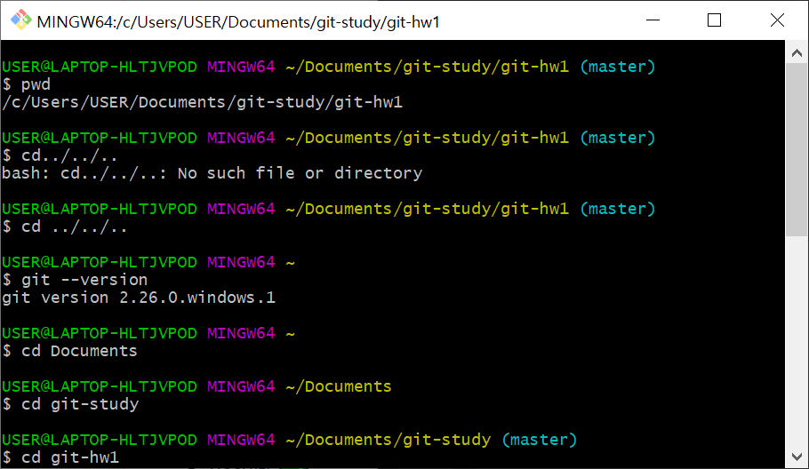
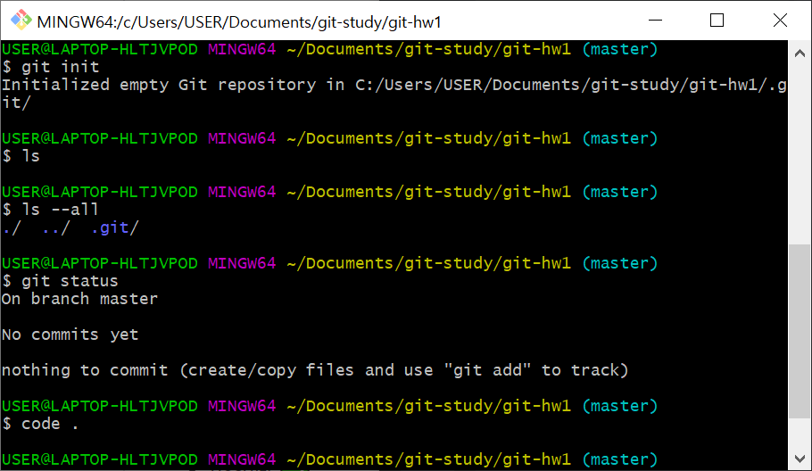
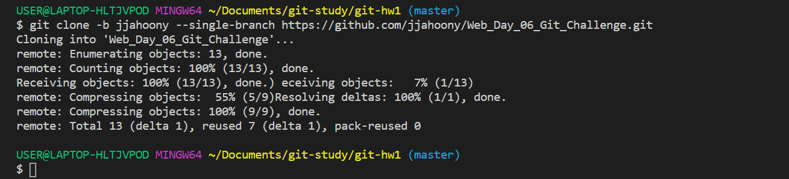

# Web_Day_06_Git_Challenge

## git bash and git terminal commands

- git --version          :     version of git

- pwd                    :     print working directory ( current location )

- cd ( )                 :     change directory

- cd ..                  :     go back to previos directory

- mkdir ( )              :     making directory

- ls                     :     list of my directory

- ls --all               :     list all of my directory

- git init               :     make a git file

-  code .                 :     install vsc

- git status            :     current status of my vsc

- git add -A            :     add all of my vsc files to git

- git add ( )           :     add particular ( )file to git

- git log               :     can see commits that I just made

- git branch -a         :     list all of the branches in my repostory

- git commit -m " "     :     commit files that I added with a message " "

- git pull origin master :    pull the files to origin master

- git push origin master :    push the files to origin master

- git remote            :     manage set of tracked repositoies

- git branch -D ( )     :     delate a branch name ( )

- git clone -b  ( )     :     clone the branch that I forked

- git checkout -b ( )   :     switch to a new branch name ( )

- git remote -v         :     see if there is any remote are not

- git remote add origin ( ) : add a remote 

- git remote set-url origin ( ) : changing git remote url to ( )

- rm -rf ( )    : refusing to remove ( )
